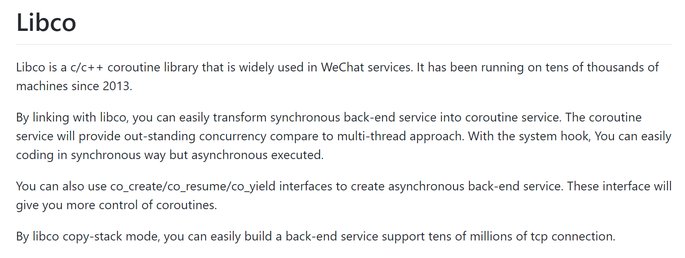

# libco源码分析

分享：intel和at&t的汇编语法的区别，然后就是栈切换的原理

## 数据对齐

过程调用时候的栈帧是，P保存调用Q的时候的参数保存。

P保存从Q返回回来的时候，需要执行的下一条指令的地址。

adc：eax, edx, ecx是由P去管理的寄存器

bsd：ebx, esi, edi是由Q去管理的寄存器

栈空间的分配内存对齐：

> 作者：圆珠笔
> 链接：https://www.zhihu.com/question/59201886/answer/162932167
> 来源：知乎
> 著作权归作者所有。商业转载请联系作者获得授权，非商业转载请注明出处。
>
> 0. 先扯句题外话，直觉告诉我，这段代码是O2编译的？这教科书不错啊
>
> 1. 2个pushq 之前，堆栈指针%rsp 除以16会余8。
>
> 2. 2个pushq 之后，堆栈指针%rsp 除以16还是余8，因为%rsp减少了16。
>
> 3.1 函数Q只需要一个long 参数，所以不需要在堆栈中准备参数， X64 SYSTEM V ABI （linux默认）要求第一个integer参数使用%rdi传递。
>
> 3.2 这时候直接调用函数Q违背了另外一条X64 SYSTEM V ABI 规则：函数调用时%rsp要能整除16（如果使用了矢量类型参数则可能要求整除32或者更多）。
>
> 3.3 所以编译器生成的汇编代码会先让%rsp自减8。此时%rsp能整除16了， 然后再call。
>
> 3.4 call的过程是先把下一条指令地址放%rsp的地址里，然后%rsp自减8，再跳转到Q。
>
> 4.1 注意此时代码执行序已经进入Q，此时堆栈指针%rsp 除以16会余8。
>
> 4.2   **1的结论来自4.1：这是一个递归的保证过程！！从main函数起每一个函数都依赖在函数入口时堆栈指针%rsp 除以16会余8，来实现无需访问%rsp具体的值的情况下(只知道%rsp mod 16 == 8)，保证在call其它函数时%rsp 能整除16(只需要做编译期模运算，这是1，2，3的运算过程)。**
>
> 4.3    4.2 我强调从main函数起没有别的意思，只是暗示在i386时代，对齐的规则没有遵守的这么严格，导致有的版本32位ＧＣＣ编译器喜欢在main函数入口  
>
> mov %esp,  %eax 
>
> and $16, %esp 
>
> push %eax   （此时 %esp mod 16 == 12， 又可以开心的做模运算啦）
>
> 来保证后续函数调用堆栈总是按16字节对齐的, 保证自己编译出来的结果在各种GLIBC和shell环境下能够正确执行。

## 寄存器相关

i386经常使用的寄存器：

通用寄存器（8个）：

eax,ebx,ecx,edx,ebp,esp

**ESI**（源变址寄存器）和**EDI**（目的变址寄存器）一般与数据段寄存器**DS**联用，用来确定数据段中某一存储单元的地址。这两个变址寄存器有自动增量和自动减量的功能，可以很方便地用于变址。在串处理指令中，**ESI**和**EDI**作为隐含的源变址和目的变址寄存器时，**ESI**和**DS**联用，**EDI**和附加段**ES**联用，分别达到在数据段和附加段中寻址的目的。

eip(rip是64位)是指令指针寄存器，它用来存放代码段中的偏移地址。在程序运行的过程中，它始终指向下一条指令的首地址。它与段寄存器**CS**联用确定下一条指令的物理地址。当这一地址送到存储器后，控制器可以取得下一条要执行的指令，而控制器一旦取得这条指令就马上修改**EIP**的内容，使它始终指向下一条指令的首地址。那些跳转指令，就是通过修改**EIP**的值来达到相应的目的的。

**FLAGS**标志寄存器，又称**PSW(program status word)**，即程序状态寄存器。这一个是存放条件标志码、控制标志和系统标志的寄存器。

段寄存器一共六个，分别是**CS**代码段，**DS**数据段，**ES**附加段，**SS**堆栈段，**FS**以及**GS**这两个还是附加段。

EFLAGS寄存器中的IF位表示是否允许中断，为1允许，否则不允许。

**TR寄存器**

用来指向当前任务的TSS段

**IDTR寄存器**

用来指向当前IDT（中断表述符表或者说是中断向量表），因为在保护模式下，IDT的起始地址可以在任何位置，而不仅限于地址0。

**GDT和LDT**

前者是全局描述符表，位置由GDTR寄存器确定，后者是局部描述符表，位置由LDTR寄存器确定，具体使用哪一个，取决于段选择码中的TI位。

## 业务

stCoRoutineEnv_t，对于每一个线程，都要创建这样一个coroutine environment，该结构体可以管理所有的函数，也就是里面有一个叫做pCallStack的东西，保存了调用的时候所有的函数。

